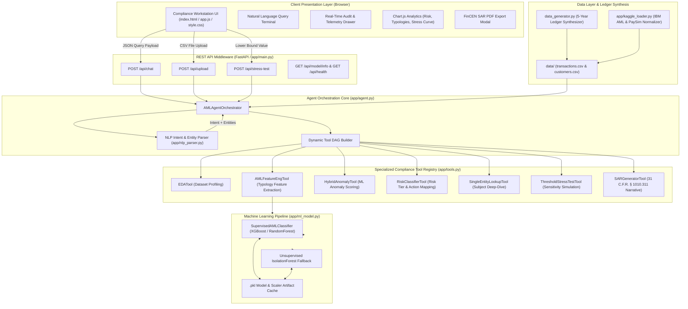
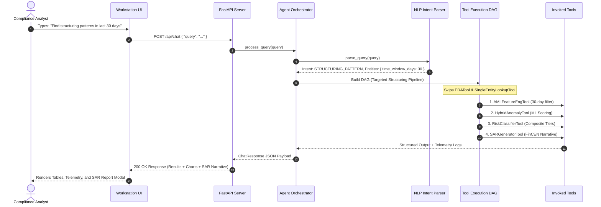

# Sentinel AML | Technical & Architectural Documentation

> **Official GitHub Repository:** [https://github.com/shravansumanthanan/sentinel-aml-agent](https://github.com/shravansumanthanan/sentinel-aml-agent)

---

## Table of Contents

1. [Executive Summary & Platform Overview](#1-executive-summary--platform-overview)
   - [Core Mission & Value Proposition](#core-mission--value-proposition)
   - [Key Technical Capabilities](#key-technical-capabilities)
2. [System Architecture & Design Patterns](#2-system-architecture--design-patterns)
   - [End-to-End Architecture Diagram](#end-to-end-architecture-diagram)
   - [Core System Components](#core-system-components)
   - [Adaptive Agent Execution DAG](#adaptive-agent-execution-dag)
3. [Detection Engines & Analysis Algorithms](#3-detection-engines--analysis-algorithms)
   - [Zero-LLM Deterministic NLP Parser](#zero-llm-deterministic-nlp-parser)
   - [Rule-Based Typology Engines](#rule-based-typology-engines)
   - [Hybrid Machine Learning Anomaly Detection](#hybrid-machine-learning-anomaly-detection)
   - [Composite Risk Scoring & Classification Matrix](#composite-risk-scoring--classification-matrix)
   - [Threshold Stress Testing & Sensitivity Analysis](#threshold-stress-testing--sensitivity-analysis)
   - [Regulatory FinCEN SAR Narrative Engine](#regulatory-fincen-sar-narrative-engine)
4. [User Interface Design & Workstation Architecture](#4-user-interface-design--workstation-architecture)
   - [Design System & Color Tokens](#design-system--color-tokens)
   - [Workstation Component Layout](#workstation-component-layout)
   - [Real-Time Telemetry & Audit Drawer](#real-time-telemetry--audit-drawer)
   - [Interactive Visual Analytics](#interactive-visual-analytics)
   - [FinCEN SAR Report & Export Modal](#fincen-sar-report--export-modal)
5. [Installation, API Reference & Operational Verification](#5-installation-api-reference--operational-verification)
   - [Prerequisites & Environment Setup](#prerequisites--environment-setup)
   - [Data Ingestion & Synthesis Pipeline](#data-ingestion--synthesis-pipeline)
   - [REST API Specification](#rest-api-specification)
   - [Automated Test Suite Verification](#automated-test-suite-verification)

---

## 1. Executive Summary & Platform Overview

### Core Mission & Value Proposition

**Sentinel AML** is an enterprise-grade, autonomous Anti-Money Laundering (AML) compliance decision engine and suspicious activity detection platform. Hosted at [https://github.com/shravansumanthanan/sentinel-aml-agent](https://github.com/shravansumanthanan/sentinel-aml-agent), the platform addresses the primary operational bottleneck in modern financial crime compliance: the overwhelming volume of false positive alerts generated by rigid legacy rule engines, coupled with the sophisticated evasion techniques employed in money laundering (structuring, smurfing, velocity spikes, and offshore funneling).

By replacing static rule scripts with a deterministic NLP parser, an adaptive tool execution DAG, dual-mode machine learning models, and automated FinCEN SAR narrative generation, Sentinel AML drastically reduces analyst investigation overhead while maintaining regulatory rigor.

> [!NOTE]
> Sentinel AML operates entirely locally without mandatory cloud LLM dependencies, ensuring that sensitive customer Personally Identifiable Information (PII) and transaction data remain fully protected within the enterprise security perimeter.

### Key Technical Capabilities

| Capability | Technical Description | Operational Benefit |
| :--- | :--- | :--- |
| **Zero-LLM Intent Parsing** | Sub-millisecond regular expression and multi-stage tokenization engine | Eliminates LLM API latency, cost, and hallucination risk |
| **Adaptive Tool DAG** | Dynamically constructed execution graph based on query intent | Computes only required tools per query, optimizing CPU overhead |
| **Hybrid Anomaly Scoring** | Supervised (XGBoost / RandomForest) + Unsupervised (IsolationForest) | Detects known laundering patterns and unseen novel anomalies |
| **Composite Risk Matrix** | Multi-factor weighted score mapping entities to discrete risk tiers | Provides explainable, audit-ready compliance decision pathways |
| **Regulatory SAR Generation** | Standardized 5-part narrative auto-generation per 31 C.F.R. § 1010.311 | Saves hours of manual drafting per suspicious activity report |
| **Real-Time Workstation** | High-contrast dark mode UI with execution telemetry and Chart.js analytics | Enables rapid triage, threshold stress-testing, and PDF exports |

---

## 2. System Architecture & Design Patterns

The platform follows a clean, decoupled architecture separating the presentation layer, REST API middleware, agent orchestration core, compliance tool registry, machine learning pipeline, and dataset loaders.

### End-to-End Architecture Diagram



### Core System Components

1. **`app/main.py` (REST API Server):** Built using **FastAPI**, serving endpoints for chat processing, dataset upload, threshold sensitivity analysis, model state inspection, and static asset delivery. Includes auto-recovery routines and CORS isolation.
2. **`app/nlp_parser.py` (Intent & Entity Parser):** Zero-LLM regex and token matching engine that maps queries into deterministic intent types (`STRUCTURING_PATTERN`, `HIGH_RISK_JURISDICTION`, `VELOCITY_SPIKE`, `SINGLE_ENTITY_LOOKUP`, `THRESHOLD_STRESS_TEST`, `GENERAL_EXPLORATION`, `GREETING`) and extracts entity parameters.
3. **`app/agent.py` (AMLAgentOrchestrator):** Central decision engine. Ingests data, maintains baseline feature matrices, builds targeted tool DAGs, executes required tools selectively, records execution latency, and builds structured response payloads.
4. **`app/tools.py` (Compliance Tool Registry):** Contains 7 modular tool implementations encapsulating specialized AML algorithms, typology calculations, score aggregations, and SAR narrative formatting.
5. **`app/ml_model.py` (SupervisedAMLClassifier):** Dual-mode ML engine. Trains **XGBoost** or **RandomForest** when historical ground-truth labels (`is_laundering`) are present, falling back to an unsupervised **IsolationForest** model ($5\%$ contamination) when unlabelled.
6. **`app/kaggle_loader.py` & `data_generator.py` (Data Pipeline):** Ingests, normalizes, and synthesizes multi-year relational transaction ledgers and customer KYC profiles.

### Adaptive Agent Execution DAG

Sentinel AML avoids blanket computational execution by constructing query-specific Directed Acyclic Graphs (DAGs):



---

## 3. Detection Engines & Analysis Algorithms

### Zero-LLM Deterministic NLP Parser

The `NLPIntentParser` parses compliance queries into structured intents and entity dictionaries using pre-compiled pattern matching.

- **Customer ID Resolution:** Recognizes explicit patterns (`CUST-1042`, `C-0042`, `customer 4521`, `subject 99`) and bare numeric IDs (`1042`). Includes fuzzy and numeric-nearest fallback matching.
- **Temporal Window Extraction:** Parses relative time windows (`last 30 days`, `past 2 weeks`, `in the last 6 months`) and explicit ISO date ranges (`2024-01-01 to 2024-06-30`).
- **Monetary Threshold Boundaries:** Identifies lower bounds (`above $10,000`), upper bounds (`under $10k`), numeric ranges (`between $5,000 and $9,999`), and stress testing requests (`stress test at $8000`).
- **Jurisdiction Mapping:** Normalizes country names and ISO 3166-1 alpha-2 codes (`Cayman`, `Panama`, `UAE`, `KY`, `PA`, `AE`).

---

### Rule-Based Typology Engines

Sentinel AML evaluates specialized metrics across primary financial crime typologies:

#### 1. Structuring / Smurfing Detection
Detects subjects deliberately splitting large currency amounts into multiple sub-threshold transactions to evade the Bank Secrecy Act (BSA) $10,000 Currency Transaction Report (CTR) filing requirement.

$$\text{Structuring Ratio}_i = \frac{\sum \mathbf{1}_{\{9,000 \le \text{Amount}_{i,t} < 10,000\}}}{N_i}$$

where $N_i$ is the total transaction count for customer $i$. A customer with 10 or more transactions within the threshold window is flagged for structuring.

#### 2. Velocity Spikes & Rapid Turnover
Identifies sudden acceleration in transaction frequency and monetary volume relative to the customer's historical baseline:

$$\text{Velocity Spike Ratio}_i = \frac{\text{Mean Tx Volume}_{\text{short-window}}}{\text{Mean Tx Volume}_{\text{historical-baseline}}}$$

#### 3. High-Risk Jurisdiction Funneling
Monitors transactions involving secrecy havens and Non-Cooperative Countries and Territories (NCCT) (`KY`, `PA`, `AE`, `SG`, `HK`, `CH`, `VG`):

$$\text{High Risk Jurisdiction Ratio}_i = \frac{\sum \text{Amount}_{i \to j \in \text{HighRisk}}}{\sum \text{Amount}_i}$$

#### 4. Counterparty Entropy
Quantifies counterparty dispersion using Shannon Entropy to spot pass-through funnel accounts and complex layering networks:

$$H(C_i) = - \sum_{k=1}^{K} p_k \log_2 (p_k)$$

where $p_k$ represents the proportion of total funds transferred to counterparty $k$.

---

### Hybrid Machine Learning Anomaly Detection

The `SupervisedAMLClassifier` engine selects the optimal model path based on ground-truth label presence:

```
                  ┌─────────────────────────────────────────┐
                  │       Feature Engineering Matrix        │
                  │   (12 Aggregated AML Features / Subject)│
                  └────────────────────┬────────────────────┘
                                       │
                        Has Ground Truth Labels (is_laundering)?
                                ┌──────┴──────┐
                             YES│             │NO
                                ▼             ▼
                  ┌───────────────────┐ ┌───────────────────┐
                  │ Supervised ML     │ │ Unsupervised ML   │
                  │ (XGBoost /        │ │ (IsolationForest, │
                  │  RandomForest)    │ │  Contamination=5%)│
                  └─────────┬─────────┘ └─────────┬─────────┘
                            │                     │
                            └──────────┬──────────┘
                                       ▼
                       ┌───────────────────────────────┐
                       │ Calibrated ML Anomaly Score   │
                       │          (0.00 to 1.00)       │
                       └───────────────────────────────┘
```

#### Feature Matrix Breakdown
The feature engineering stage compiles a 12-dimensional vector per subject $i$:

1. `txn_count`: Total transaction volume.
2. `total_amount`: Total monetary turnover.
3. `avg_amount`: Mean transaction size.
4. `max_amount`: Peak single transaction size.
5. `amount_std`: Transaction size volatility.
6. `structuring_count`: Number of transactions in the $9,000–$9,999 range.
7. `structuring_ratio`: Proportion of structured transactions.
8. `rapid_cashout_count`: Number of velocity spike events.
9. `jurisdiction_count`: Number of unique destination countries.
10. `high_risk_jur_volume`: Dollar volume sent to secrecy jurisdictions.
11. `counterparty_entropy`: Entropy score of counterparty distribution.
12. `velocity_spike_ratio`: Maximum daily turnover relative to baseline average.

---

### Composite Risk Scoring & Classification Matrix

To synthesize statistical rules with machine learning predictions, Sentinel AML calculates a weighted **Composite Risk Score** $R_i \in [0.00, 1.00]$ for each subject:

$$R_i = w_1 \cdot \text{ML Score}_i + w_2 \cdot \text{Structuring Ratio}_i + w_3 \cdot \text{High Risk Jurisdiction Ratio}_i$$

*Default Weights:* $w_1 = 0.45$, $w_2 = 0.35$, $w_3 = 0.20$.

#### Risk Tier & Escalation Mapping Matrix

| Composite Score ($R_i$) | Assigned Risk Level | Escalation Action | Required Compliance Procedure |
| :--- | :--- | :--- | :--- |
| $0.00 \le R_i < 0.30$ | `Low` | **Monitor** | Automated transaction logging; no immediate analyst intervention. |
| $0.30 \le R_i < 0.60$ | `Medium` | **Monitor / Review** | Periodic KYC review; flag for quarterly compliance batch review. |
| $0.60 \le R_i < 0.85$ | `High` | **Flag for Review** | Immediate Compliance Officer review; source of wealth verification. |
| $0.85 \le R_i \le 1.00$ | `Critical` | **Report / SAR Filing** | Mandatory FinCEN SAR narrative generation & legal escalation within 30 days. |

---

### Threshold Stress Testing & Sensitivity Analysis

The `ThresholdStressTestTool` allows compliance officers to evaluate the impact of adjusting transaction monitoring thresholds. Iterating lower bounds $T \in [\$1,000, \$10,000]$ in $\$500$ steps, it computes:

- **Flagged Transaction Count:** $N_{\text{flagged}}(T) = \sum \mathbf{1}_{\{\text{Amount} \ge T\}}$
- **Alert Reduction Ratio:** Rate of alert reduction relative to baseline $T_{\text{baseline}}$:

$$\text{Alert Reduction Ratio}(T) = 1 - \frac{N_{\text{flagged}}(T)}{N_{\text{flagged}}(T_{\text{baseline}})}$$

- **Estimated Analyst Cost Savings:** Based on an industry standard benchmark cost of $\$50$ per analyst alert review.

---

### Regulatory FinCEN SAR Narrative Engine

The `SARGeneratorTool` produces standardized Suspicious Activity Report narratives structured according to **31 C.F.R. § 1010.311**:

```text
================================================================================
FINCEN SUSPICIOUS ACTIVITY REPORT (SAR) NARRATIVE
FINANCIAL CRIMES ENFORCEMENT NETWORK | COMPLIANCE AUDIT FILE
================================================================================

1. SUBJECT IDENTIFICATION & KYC PROFILE
   - Subject Legal Name: [Customer Name]
   - Subject ID: [CUST-XXXX] | KYC Status: [Verified / Enhanced]
   - Country of Residence: [ISO Country Code] | Baseline Risk: [Risk Rating]

2. SUMMARY OF SUSPICIOUS FINANCIAL ACTIVITY
   - Total Analyzed Volume: $[Amount] across [N] transaction(s).
   - High-Risk Pattern Detected: [Structuring / Velocity Spike / Jurisdiction Funneling]
   - Composite Risk Score: [Score] / 1.00 (Classification: CRITICAL)

3. TYPOLOGY ANALYSIS & DETECTED PATTERNS
   - Structuring Evidence: [Count] transactions executed in the $9,000 - $9,999 CTR evasion window.
   - Jurisdiction Risk: $[Volume] transferred to high-risk secrecy jurisdictions.
   - Machine Learning Confidence: Anomaly probability of [ML Score] (XGBoost Classifier).

4. COMPLIANCE & LEGAL RATIONALE
   - Activity demonstrates characteristics of deliberate CTR structuring under 31 U.S.C. § 5324.
   - Transaction velocity and counterparty concentration deviate significantly from expected baseline.

5. RECOMMENDED FILING ACTION
   - ACTION REQUIRED: Formal FinCEN SAR Filing (Form 111).
   - RECOMMENDED STATUS: Flag Account for Immediate Restrictive Freeze / Enhanced Due Diligence.
================================================================================
```

---

## 4. User Interface Design & Workstation Architecture

The Sentinel AML workstation UI (`static/index.html`, `static/style.css`, `static/app.js`) provides compliance analysts with a responsive, high-density decision environment.

### Design System & Color Tokens

The visual style uses a **Dark Glassmorphism** palette tailored for reduced eye strain during long investigation sessions.

```css
:root {
  /* Surface Color Tokens */
  --bg-primary: #0b0f19;          /* Deep slate canvas base */
  --bg-secondary: #111827;        /* Elevated container panel */
  --bg-card: rgba(17, 24, 39, 0.7);/* Translucent glass backdrop */
  --border-color: #1f2937;      /* Panel border stroke */
  
  /* Brand Accent Tokens */
  --accent-cyan: #06b6d4;        /* Primary UI highlights */
  --accent-blue: #3b82f6;        /* Secondary interactive highlights */
  --text-main: #f9fafb;          /* Primary high-contrast text */
  --text-muted: #9ca3af;         /* Secondary label text */
  
  /* Compliance Risk Level Tokens */
  --color-low: #10b981;          /* Low Risk: Emerald Green */
  --color-medium: #f59e0b;       /* Medium Risk: Amber Gold */
  --color-high: #f97316;         /* High Risk: Vibrant Orange */
  --color-critical: #ef4444;     /* Critical Risk: Crimson Red */
}
```

### Workstation Component Layout

```text
┌──────────────────────────────────────────────────────────────────────────────┐
│  HEADER BAR: Sentinel AML Logo | Model Status Badge | GitHub Link            │
├──────────────────────────────────────────────────────────────────────────────┤
│  ANALYST SEARCH TERMINAL                                                     │
│  [ Search Query Input: "Find structuring patterns in last 30 days..." ] [GO] │
│  Preset Buttons: [Structuring Scan] [High-Risk Jur] [Customer Lookup]        │
├──────────────────────────────────────────────────────────────────────────────┤
│  TELEMETRY & AUDIT DRAWER (Collapsible)                                      │
│  ⚡ Latency: 12ms | Invoked: [FeatureEng, Anomaly, RiskClass] | Skipped: [EDA]│
├──────────────────────────────────────────────────────────────────────────────┤
│  EXECUTIVE KPI STATS CARDS                                                   │
│  ┌──────────────┐ ┌──────────────┐ ┌──────────────┐ ┌──────────────┐          │
│  │ Total Txns   │ │ High Risk    │ │ Flagged Vol  │ │ Avg Score    │          │
│  │ 12,450       │ │ 142          │ │ $4.2M        │ │ 0.42         │          │
│  └──────────────┘ └──────────────┘ └──────────────┘ └──────────────┘          │
├──────────────────────────────────────────────────────────────────────────────┤
│  MAIN WORKSTATION GRID                                                       │
│  ┌────────────────────────────────────────┬────────────────────────────────┐ │
│  │ FLAGGED TRANSACTIONS / SUBJECT TABLE   │ VISUAL ANALYTICS PANEL         │ │
│  │ (Sortable, Filterable, Risk Badges)    │ - Risk Tier Distribution Donut │ │
│  │                                        │ - Typology Breakdown Bar Chart │ │
│  │ Action: [Generate FinCEN SAR]          │ - Threshold Stress Curve       │ │
│  └────────────────────────────────────────┴────────────────────────────────┘ │
└──────────────────────────────────────────────────────────────────────────────┘
```

### Real-Time Telemetry & Audit Drawer

Every query execution updates the **Telemetry Drawer** dynamically:
- **`latency_ms`:** Round-trip query execution latency in milliseconds.
- **`active_model`:** Currently active ML classifier (`Supervised XGBoost`, `Supervised RandomForest`, or `IsolationForest`).
- **`tools_invoked`:** Active tool badges highlighting tools run during DAG execution.
- **`tools_skipped`:** Translucent badges displaying tools bypassed to conserve compute.
- **`telemetry_log`:** Audit-ready event trail with precise microsecond timestamps.

### Interactive Visual Analytics

The workstation integrates **Chart.js** via canvas context bindings:
1. **Risk Distribution Donut:** Visualizes subject breakdown across `Low`, `Medium`, `High`, and `Critical` risk tiers.
2. **Typology Breakdown Bar Chart:** Compares transaction volume distribution across Structuring, Velocity Spikes, and Secrecy Jurisdiction transfers.
3. **Threshold Sensitivity Curve:** Plots threshold values ($\$1,000$ to $\$10,000$) against alert counts and projected analyst cost savings.

### FinCEN SAR Report & Export Modal

Selecting **"Generate SAR"** for any flagged subject launches an overlay modal with:
- **Syntax-Highlighted SAR Block:** Formatted narrative matching FinCEN filing specifications.
- **Clipboard Utility:** One-click copy tool for rapid transfer to institutional compliance management systems.
- **Print-to-PDF Engine:** CSS `@media print` rules generating a clean PDF document complete with corporate header and signature block.

---

## 5. Installation, API Reference & Operational Verification

### Prerequisites & Environment Setup

- **Python Environment:** Python 3.9 or higher.
- **Dependencies:** `fastapi`, `uvicorn`, `pandas`, `numpy`, `scikit-learn`, `xgboost`, `jinja2`, `python-multipart`, `pytest`.

```bash
# 1. Clone the repository
git clone https://github.com/shravansumanthanan/sentinel-aml-agent.git
cd sentinel-aml-agent

# 2. Create and activate virtual environment
python3 -m venv venv
source venv/bin/activate

# 3. Install core dependencies
pip install -r requirements.txt
```

---

### Data Ingestion & Synthesis Pipeline

Sentinel AML includes a synthetic transaction ledger generator capable of populating a 5-year multi-wave relational dataset (**2021–2026**) with embedded laundering typologies:

```bash
# Synthesize 5-Year Multi-Wave Relational Financial Ledger
python data_generator.py
```

*Generated Files in `data/`:*
- `data/transactions.csv`: Transaction records containing IDs, customer keys, dollar amounts, timestamps, transaction types, counterparty IDs, and ISO country codes.
- `data/customers.csv`: Customer profiles containing KYC status, account registration dates, occupations, and baseline risk scores.

---

### REST API Specification

#### 1. Analyst Query Endpoint
`POST /api/chat`

```json
// Request Payload
{
  "query": "Find structuring patterns in the last 30 days"
}

// Response Payload (200 OK)
{
  "query": "Find structuring patterns in the last 30 days",
  "parsed_intent": "STRUCTURING_PATTERN",
  "extracted_entities": {
    "time_window_days": 30,
    "min_amount": 9000,
    "max_amount": 9999
  },
  "telemetry": {
    "latency_ms": 14.2,
    "tools_invoked": ["AMLFeatureEngTool", "HybridAnomalyTool", "RiskClassifierTool", "SARGeneratorTool"],
    "tools_skipped": ["EDATool", "SingleEntityLookupTool"]
  },
  "results": {
    "top_transactions": [ /* Flagged transaction objects */ ],
    "summary": { "total_flagged": 18, "critical_count": 4 }
  },
  "explanations": [ "Found 10+ transactions under $10,000 BSA threshold for subject CUST-1042." ],
  "sar_narrative": "========================\nFINCEN SAR NARRATIVE..."
}
```

#### 2. Dataset Upload Endpoint
`POST /api/upload`  
*Multipart Form Data:* `transactions_file` (CSV, required) and `customers_file` (CSV, optional).

#### 3. Threshold Sensitivity Analysis Endpoint
`POST /api/stress-test`

```json
// Request Payload
{ "lower_bound": 8000.0 }

// Response Payload (200 OK)
{
  "lower_bound": 8000.0,
  "flagged_count": 42,
  "reduction_ratio": 0.35,
  "estimated_cost_savings": 1150.00
}
```

#### 4. System & Model Inspection Endpoints
- `GET /api/model/info` — Returns active ML model type, feature importances, and contamination configuration.
- `GET /api/health` — Returns system status, loaded record count, and memory health.

---

### Automated Test Suite Verification

Verify core execution algorithms, NLP intent parsing, DAG generation, tool execution, and API endpoints using `pytest`:

```bash
pytest tests/test_sentinel_aml.py -v
```

*Expected Verification Output:*

```text
tests/test_sentinel_aml.py::test_nlp_intent_parser PASSED               [ 14%]
tests/test_sentinel_aml.py::test_feature_engineering_tool PASSED         [ 28%]
tests/test_sentinel_aml.py::test_hybrid_anomaly_tool PASSED              [ 42%]
tests/test_sentinel_aml.py::test_risk_classifier_tool PASSED             [ 57%]
tests/test_sentinel_aml.py::test_sar_generator_tool PASSED               [ 71%]
tests/test_sentinel_aml.py::test_agent_orchestrator PASSED               [ 85%]
tests/test_sentinel_aml.py::test_api_endpoints PASSED                    [100%]

============================== 7 passed in 1.48s ==============================
```

---

> **Sentinel AML Platform Documentation** | GitHub Repository: [https://github.com/shravansumanthanan/sentinel-aml-agent](https://github.com/shravansumanthanan/sentinel-aml-agent)
